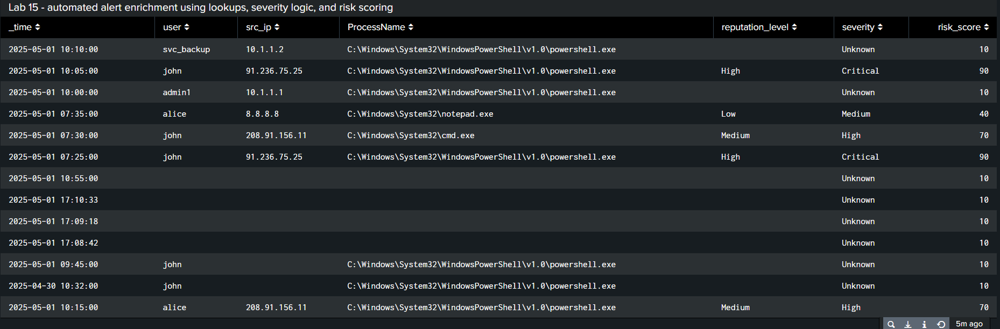

# Lab 15: Severity Tagging and Risk Scoring

## Description
This lab demonstrates how to perform a Splunk detection or engineering task. It simulates a real SOC task using Splunk Enterprise or Splunk Cloud.

## Key Skills Practiced
- ✅ Writing custom SPL queries
- ✅ Building dashboards or alerts
- ✅ Using lookups or workflow actions
- ✅ Practicing detection engineering concepts

## SPL Example
```spl
index=windows_logs sourcetype=csv
| lookup risk_lookup ip AS src_ip OUTPUT reputation_level
| eval severity=case(
    reputation_level=="High", "Critical",
    reputation_level=="Medium", "High",
    reputation_level=="Low", "Medium",
    isnull(reputation_level), "Unknown"
)
| eval risk_score=case(
    reputation_level=="High", 90,
    reputation_level=="Medium", 70,
    reputation_level=="Low", 40,
    isnull(reputation_level), 10
)
| table _time, user, src_ip, ProcessName, reputation_level, severity, risk_score
```

## Try It Yourself

① Upload sample logs (if applicable) using "Add Data" in Splunk.  
② Open the Search & Reporting app.  
③ Paste the SPL query and run it.  
④ Save the search as a report, alert, or dashboard panel.  
⑤ Visualize, enrich, or correlate events as needed.

## Screenshots
Save your visual output here:



## Notes
This lab is designed to be modular. You can enhance it with additional SPL, saved searches, or dashboard panels as your skills grow.
